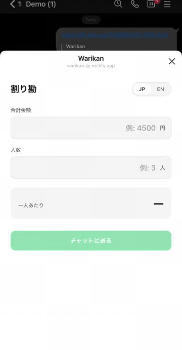
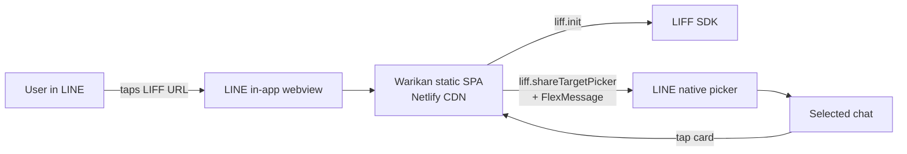

# warikan 割り勘

A LIFF mini-app for splitting a bill across people in a LINE chat. Tap a button, pick a chat, the split lands as a clean message everyone in the group can see.

> Built to demonstrate the LIFF SDK surface — `liff.init`, `liff.shareTargetPicker`, FlexMessage payloads — on a small, single-screen utility shaped for actual daily use in Japan.

<p align="center">
  
</p>

<p align="center">
  <a href="https://liff.line.me/2009905533-DGtLYpEl"><b>Open in LINE</b></a>  ·  <a href="https://warikan-jp.netlify.app"><b>Web preview</b></a>
</p>



---

## Why this exists

Splitting a bill is the most common reason a group of friends in Japan opens a chat. Most existing tools push you to a browser, ask for an account, or assume USD-shaped math. Warikan does the smallest version of the right thing: type two numbers, tap, share — directly into the LINE chat where the people who owe you money already are.

The constraints that shaped the design:

- **One screen.** Calculator-shaped, mobile-first.
- **No backend.** State lives in URL params; the app is a static bundle.
- **No login.** LIFF gives us the user's session; we don't ask for anything more.
- **JP cultural correctness.** ¥100 round-up, JP/EN toggle, JP-first default.
- **`shareTargetPicker` is the climax**, not a feature. Every interaction earns its place by getting closer to that single tap.

## Architecture



No server. The entire app is HTML + 30KB of JS on a CDN. LIFF handles authentication implicitly (the user is already signed into LINE). The `shareTargetPicker` call hands a FlexMessage payload to LINE's native UI; LINE renders the card in the chosen chat.

## Key decisions

| Decision | Why |
|---|---|
| **Vite + TypeScript, no framework** | One screen doesn't earn React's component model. Smaller bundle matters more here — LIFF loads inside a phone webview on mobile data. |
| **Custom 60-line i18n module, no library** | 15 strings of UI copy don't justify `i18next`. A frozen `dict` + `t(key)` + listener pattern is enough and stays type-safe via `as const`. |
| **¥100 round-up, not nearest** | JP cultural convention — nobody asks for ¥17. Round-up means the organizer never ends up short. |
| **In-bundle FlexMessage builder, not server-rendered** | No server. The message JSON is built client-side and handed straight to `shareTargetPicker`. |
| **LIFF mock for local dev** | LIFF apps fail outside LINE. A 30-line mock at `src/liff-mock.ts` lets the calculation logic be tested on `localhost` without LINE; the real SDK loads only in production builds via `import.meta.env.DEV`. |
| **`inputmode="numeric"` not `<input type="number">`** | Brings up the mobile number keypad without `type="number"`'s formatting quirks. We control parsing in JS. |

## What I deliberately did not build

These were tempting and got cut to keep v1 focused:

- **Per-person custom amounts** (someone had two drinks, someone didn't drink). Real, useful — but doubles the UI complexity. v1.5 candidate.
- **History / saved splits.** Would need a backend or `IndexedDB`. Not a v1 problem.
- **Tip percentage.** No tipping in Japan. Adding it would be cargo-culted from US apps.
- **`liff.getProfile()` personalization** ("Luis says you owe ¥1,500"). Requires a permission prompt with no v1 benefit. v1.5 candidate.
- **Manual dark mode toggle.** LINE's iOS webview doesn't reliably propagate `prefers-color-scheme` to embedded LIFF apps — a known platform constraint, not a bug in the CSS. Rather than ship a half-working dark mode, the app is light-only in v1. A manual toggle (sun/moon, persisted to localStorage like the language toggle) is the v1.5 candidate if dark mode becomes user-requested.

## Local development

```bash
git clone https://github.com/luisrrv/warikan
cd warikan
pnpm install
pnpm dev
```

Open `http://localhost:5173`. The LIFF mock at `src/liff-mock.ts` stands in for the real SDK — clicking share opens an `alert()` with the FlexMessage JSON instead of LINE's picker.

To test inside LINE, deploy to a static host with HTTPS, register the URL in the [LINE Developers console](https://developers.line.biz/console/) under your channel's LIFF tab, and set `VITE_LIFF_ID` in your environment.

## Stack

Vite · TypeScript · `@line/liff` · Netlify (static host)

No backend, no database, no test framework, no state library. Production bundle: ~35KB gzipped.

## License

MIT